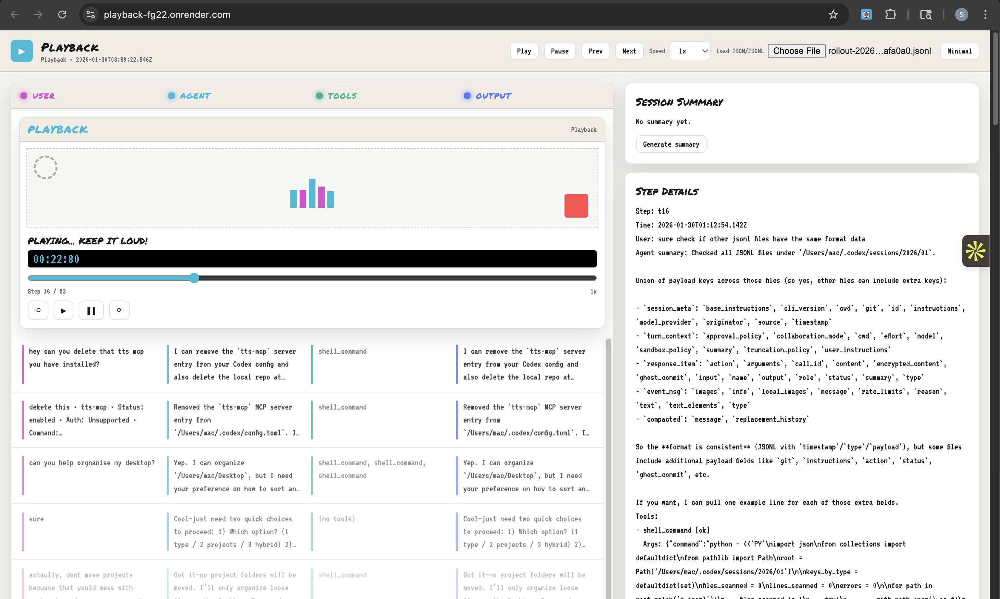

# Playback

Playback turns raw agent session logs into a clear, step‑by‑step timeline so you can see what the user asked, what the agent did, which tools ran, and how the session progressed.



## Run locally

```bash
cd /Users/mac/Desktop/playback-mvp
npm install
npm start
```

Open: `http://localhost:3000`

## Upload a session

```bash
node /Users/mac/Desktop/playback-mvp/cli.js /path/to/session.jsonl
```

It prints a URL like:

```
http://localhost:3000/session/<session_id>
```

### Generate LLM summary on upload

```bash
node /Users/mac/Desktop/playback-mvp/cli.js /path/to/session.jsonl --summarize
```

Set `OPENAI_API_KEY` and optional `OPENAI_MODEL` in your environment or Render.

## Deploy to Render

This repo includes a `render.yaml` blueprint.

[](https://render.com/deploy?repo=https://github.com/suhaasteja/playback)

### Environment variables

- `TTL_SECONDS` (default: 3600)
- `MAX_SESSIONS` (default: 200)
- `JSON_LIMIT` (default: 25mb)
- `OPENAI_API_KEY` (required for summaries)
- `OPENAI_MODEL` (default: gpt-4.1)
